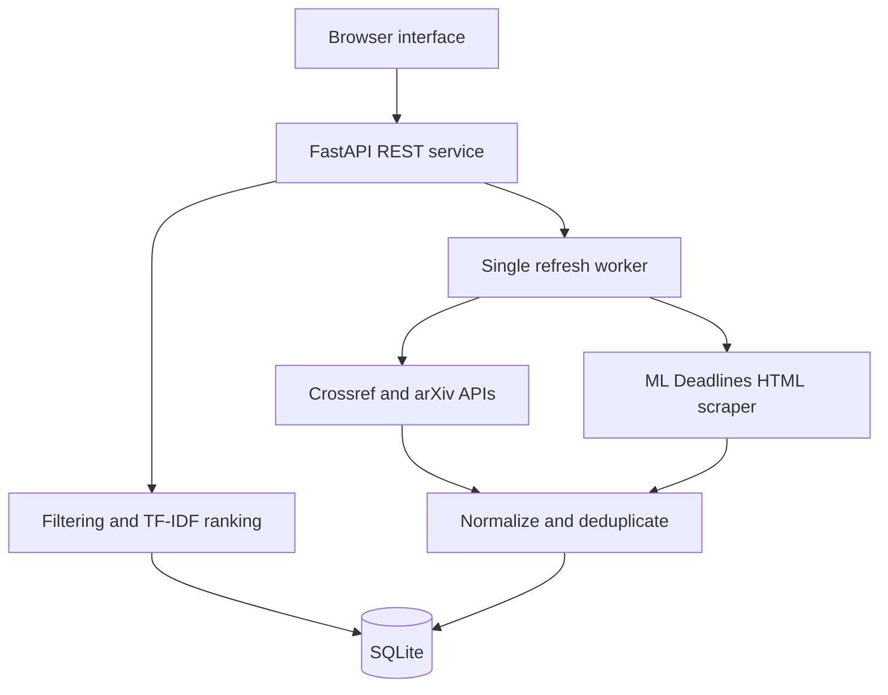

# Eureka

**Multi-Source Research Paper and Conference Opportunity Discovery using Web Scraping and REST APIs**

A working local research workspace: discover papers, find conference calls for papers, save a collection, and export it. The interface and REST API run together in one Python process.

## Start on Windows

Use **Python 3.12** (recommended; Python 3.11 is also covered by CI).

### If you downloaded the ZIP

1. Extract the ZIP completely.
2. Open the extracted folder containing `run.py` and `requirements.txt`.
3. Click File Explorer's address bar, type `powershell`, and press Enter.
4. Run each command below separately. Continue only when the previous command succeeds:

```powershell
py --list
py -3.12 -m venv .venv
.\.venv\Scripts\python.exe -m pip install -r requirements.txt
.\.venv\Scripts\python.exe run.py
```

If your installed version is 3.11, use `py -3.11 -m venv .venv` instead. If Python 3.12 is missing, install it using `py install 3.12` when using the Python Install Manager, or install it from [python.org](https://www.python.org/downloads/windows/), then reopen PowerShell. A failed virtual-environment command means the later `.venv` commands cannot work yet. No activation command or PowerShell execution-policy change is needed.

### If you use Git

```powershell
git clone https://github.com/yajask-maker/Webscrap_proj_Sem5.git
cd Webscrap_proj_Sem5
py -3.12 -m venv .venv
.\.venv\Scripts\python.exe -m pip install -r requirements.txt
.\.venv\Scripts\python.exe run.py
```

Open **http://127.0.0.1:8000** and keep the terminal open. Stop the server with Ctrl+C. For subsequent starts, only the last command is needed.

### Update an existing installation

Stop the server first. If you cloned with Git, run `git pull`. If you downloaded a ZIP, download and extract the latest ZIP into a **new folder**, then copy your existing `data` folder and `.env` (if present) into it to keep your saved collection. Create a new `.venv` in that folder using the commands above. Do not copy the old `.venv` between folders.

After Git updates, rerun the dependency installation command and restart the server. Refresh the browser with Ctrl+F5 to load updated interface files.

## Start on macOS / Linux

```bash
git clone https://github.com/yajask-maker/Webscrap_proj_Sem5.git
cd Webscrap_proj_Sem5
python3.12 -m venv .venv
.venv/bin/python -m pip install -r requirements.txt
.venv/bin/python run.py
```

No Node.js, frontend build, API key, or database server is required. The database initializes automatically at `data/eureka.db` and is excluded from Git. Keep that file to preserve your collection. Do not delete it to refresh sources.

## Use it

1. Leave **Data → Live sources** selected and search a topic, such as `graph neural networks`.
2. Eureka retrieves up to 30 results each from Crossref and arXiv and collects the conference index. Source progress and partial failures appear above the results.
3. Filter papers by provider or year. Click a title to inspect its abstract, identifiers, source links, retrieval time, and observations.
4. Select **Conferences** to search the collected index by topic, location, or deadline status. **Browse collected** clears the topic query. Check official sites for abstract registration, track rules, and changes.
5. Use the square bookmark button or save a note in the details dialog. Open **Saved collection** to revisit records.
6. **Export CSV** exports all matching records, including filters, rather than only the visible page. Exports include collection notes and are capped at 5,000 rows.
7. **Overview** shows collection counts, upcoming deadlines, bookmarked upcoming deadlines, and source health.

**Demo examples** creates six fictional papers and five fictional conferences. It works offline, is prominently labeled, and stays separate from live records. Example deadlines are generated on first load and may eventually expire. Switching modes does not delete either collection.

## Implemented

- Crossref JSON REST API and arXiv Atom API integration.
- Beautiful Soup scraping of ML Deadlines HTML, with runtime robots checks.
- SQLite persistence, source provenance, observation history, and identifier-based deduplication.
- TF-IDF/cosine-similarity search, matching terms, provider/year/location/deadline filters, and pagination.
- Persistent bookmarks and notes, filtered CSV export, and deadline dashboard.
- Background refresh jobs, a 24-hour cache, throttling, bounded retries, and per-source error reporting.
- Date precision and uncertainty handling; expired dates are never presented as open deadlines.
- Responsive browser interface, interactive API documentation, and offline tests.

## Configuration

Optionally copy `.env.example` to `.env`:

| Variable | Default | Purpose |
| --- | --- | --- |
| `EUREKA_DB` | `data/eureka.db` | Database path; relative paths are resolved from the project folder |
| `EUREKA_CONTACT_EMAIL` | Empty | Your contact email for Crossref's polite access pool |

Do not commit `.env`. The application honors standard HTTP proxy environment variables; SOCKS support is included. The `.env` file is also read from the project folder regardless of the terminal directory. Run **one server process** so the provider throttles and refresh lock apply to the whole application.

## Tests

Windows:

```powershell
.\.venv\Scripts\python.exe -m pip install -r requirements-dev.txt
.\.venv\Scripts\python.exe -m pytest -q
```

macOS / Linux:

```bash
.venv/bin/python -m pip install -r requirements-dev.txt
.venv/bin/python -m pytest -q
```

Tests use synthetic fixtures and mocked HTTP, so CI does not crawl providers. `requirements-lock.txt` records the full Python 3.12 verification environment, including test dependencies; install it instead of `requirements-dev.txt` when reproducing that exact environment. See [verification results](docs/VERIFICATION.md) for observed live behavior and remaining checks.

Optional interface interaction checks require Node.js 20+ only for development: run `npm ci` and `npm run test:ui` after installing the Python test dependencies. The runner uses `.venv` when present; `EUREKA_PYTHON` can select another Python executable. This checks the DOM against the real API without crawling providers. For real Chromium checks, run `npx playwright install chromium` and `npm run test:browser`. The browser suite uses deterministic providers and checks desktop/mobile layout overflow, bookmarks, notes, CSV downloads, pagination, and partial source failure. CI runs Python and DOM tests on Windows and Linux with Python 3.11/3.12, plus Chromium on Python 3.12.

## Architecture



| Path | Responsibility |
| --- | --- |
| `run.py` | Start the local server |
| `app/main.py` | API, lifecycle, static interface, local-origin protection |
| `app/sources.py` | Fixed-provider HTTP clients and parsers |
| `app/db.py` | Persistence, aliases, history, bookmarks, jobs, source cache |
| `app/models.py` | Common records, identifier and deadline handling |
| `app/service.py` | Background refresh and per-source status |
| `app/search.py` | Filtering, ranking, CSV export |
| `app/static/` | HTML, CSS, and vanilla JavaScript interface |
| `app/demo.py` | Isolated synthetic demonstration records |
| `tests/` | Offline automated tests |

## API and project notes

- Interactive API documentation: http://127.0.0.1:8000/docs
- [API reference](docs/API.md)
- [Single-session implementation checklist](docs/IMPLEMENTATION_PLAN.md)
- [Data source register](docs/SOURCES.md)
- [Verification results and limitations](docs/VERIFICATION.md)

This is a local, single-user miniproject. It has no account system, email notifications, scheduled crawler, semantic embeddings, or public-hosting configuration. Do not expose it publicly without adding authentication and per-user data ownership. Conference coverage comes from one aggregator and can be incomplete; an open paper deadline does not guarantee eligibility if an earlier registration deadline has passed. Paper ranking measures text relevance, not credibility or scientific quality.

## Troubleshooting sources

- **arXiv timed out:** Eureka makes up to three attempts, with a 30-second read timeout and at least 3.1 seconds between arXiv requests. A slow or unavailable provider can still fail. Wait before retrying, or choose **Source → Crossref** and search again. Previously stored records remain available through **Browse collected**.
- **Partial refresh warning:** the amber message means at least one provider succeeded and another failed. Check **Overview → Source health** for the individual result. A red message indicates the refresh failed completely or another application request failed.
- **Cannot connect:** confirm your internet connection and any configured HTTP proxy. This application cannot repair an upstream outage or a blocked network route.
- **No matching results:** reset filters and select **Browse collected**. Searches rank the stored collection; sources return only a limited number of papers per query.
- **Port 8000 already in use:** stop the earlier Eureka terminal with Ctrl+C before starting another server.
- **Offline presentation:** choose **Data → Demo examples**. All demo records are explicitly fictional.
