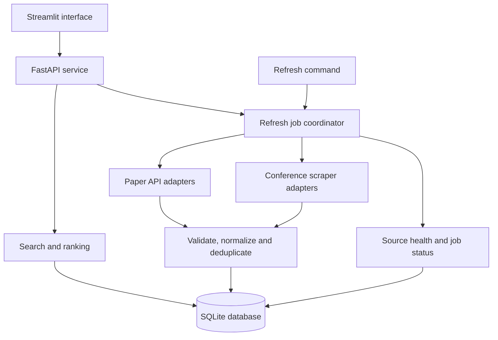

# Eureka implementation plan

Planning baseline: 30 September 2026. The repository was empty when inspected. This document specifies proposed work; it does not claim that application features have been implemented or tested.

## 1. Problem and objective

Research discovery often requires switching between paper databases and conference websites. The same paper may appear in several sources, while conference deadlines, locations, and topics use inconsistent formats. Eureka will combine these discovery tasks in a searchable application with traceable sources.

The main objective is to build a demonstrable end-to-end pipeline: retrieve paper metadata through REST/HTTP APIs, scrape permitted conference pages, normalize and store the results, and help a user discover relevant papers and submission opportunities.

Assumptions: a six-week part-time miniproject, a local single-user application, a small dataset, and no required paid service. Weeks are relative milestones, not an asserted submission deadline. Suggested module ownership can be divided among the actual team members; no team size is assumed.

## 2. Scope and user journeys

### MVP requirements

| ID | Requirement | Completion evidence |
| --- | --- | --- |
| FR1 | Search two paper sources with a topic query | One query retrieves Crossref and arXiv records with source labels |
| FR2 | Discover conference opportunities from permitted HTML pages | At least one live scraper extracts traceable conference records |
| FR3 | Normalize and deduplicate results | Confirmed duplicates share one result while retaining source records |
| FR4 | Filter and sort results | Paper year/source filters and conference location/deadline filters work |
| FR5 | Explain relevance | Result cards show matching terms and a comparable relevance score |
| FR6 | Save and remove bookmarks | Saved papers and conferences survive application restart |
| FR7 | Export selected results | CSV contains stable IDs, useful metadata, and original source URLs |
| FR8 | Display approaching deadlines | Dashboard distinguishes known, expired, uncertain, and missing dates |
| FR9 | Report source health | A failing provider does not erase successful results or cached data |

Primary journey: enter a topic such as "graph neural networks", compare paper results, open an original record, bookmark a useful paper, switch to matching conferences, inspect the official submission page, and export a shortlist.

Secondary journey: open the dashboard, review bookmarked conference deadlines, refresh available data, and see whether the displayed information is current or cached.

### Extensions after the MVP

Additional providers; saved-search scheduling; opt-in email reminders; BibTeX and calendar export; embedding-based matching; user accounts; PostgreSQL; and public hosting. Do not add these until the core acceptance criteria pass.

Out of scope for the MVP: downloading or hosting full-text paper collections, automated paper submission, claiming conference credibility or guaranteed acceptance, crawling the entire web, and LLM-generated paper summaries.

## 3. Source strategy and feasibility gate

Use Crossref for bibliographic metadata and arXiv for research preprints. Crossref provides the project's JSON REST integration; arXiv adds an HTTP API returning Atom XML. Use a source-specific parser rather than assuming all APIs return JSON. See [SOURCES.md](SOURCES.md) for documentation and constraints.

For conferences, evaluate WikiCFP and a small allowlist of official conference call-for-papers pages in week 1. Before enabling a source, verify its terms, robots directives, public access, useful fields, and a permitted request cadence. Record the exact approved URL patterns and review date. Public visibility alone is not approval to scrape.

**Gate G1:** finish week 1 with two paper API smoke checks and at least one feasible, permitted conference scraping source. If a candidate is unsuitable, select another permitted official page. Fixtures and manual entries support development but cannot substitute for the final live scraping requirement. If no source is feasible, explicitly rescope the project before claiming completion.

Do not infer upcoming conference opportunities from a paper's publication venue: historical proceedings metadata is not a current call for papers.

## 4. Architecture and technology choices

Use a small modular Python application. Streamlit calls the FastAPI service; the service owns application logic and database access. A refresh command invokes the same acquisition services. Avoid separate business logic in the UI.

| Component | Proposed choice | Reason |
| --- | --- | --- |
| Runtime | Python 3.11 or 3.12 | Choose one supported version and validate it in CI |
| UI | Streamlit | Fast development of search forms, tables, cards, and filters |
| REST service | FastAPI, Pydantic, Uvicorn | Explicit request/response validation and an independently testable API |
| HTTP | HTTPX | One shared place for timeouts, headers, and provider handling |
| HTML | Beautiful Soup with an HTML parser | Source-specific extraction from permitted static pages |
| Atom | feedparser | Dedicated arXiv response parsing |
| Persistence | SQLite and SQLAlchemy | Simple local deployment with relational constraints |
| Ranking | scikit-learn | Transparent TF-IDF baseline without paid inference |
| Tests | pytest and mocked HTTP transport | Repeatable checks without live provider dependencies |
| CI | GitHub Actions | Run offline tests and linting on changes |

Pin tested dependency versions when the skeleton is implemented. A browser automation dependency is unnecessary for the initial static-page sources. Keep one ingestion worker and serialize database writes; use SQLite foreign keys, short transactions, a busy timeout, and WAL mode. Revisit the database choice if concurrent public usage becomes a requirement.

## 5. Acquisition and processing pipeline

1. Validate and normalize the query and filters. Reject empty queries, oversized input, invalid ranges, and unsupported sources.
2. Read the stored result set and return it promptly with timestamps. If requested data is missing or stale, enqueue a bounded refresh and return its job ID.
3. Translate the query for each paper provider. Fetch configured conference pages independently of arbitrary user URLs, then search their stored records locally.
4. Apply each provider's rate limits, pagination bounds, timeouts, and retry policy. Different providers can run independently; requests within one provider obey its connection limit.
5. Parse into source-specific records. Validate title and source identity; retain optional missing fields as null. Quarantine invalid records with a reason rather than discarding an entire batch.
6. Normalize whitespace, identifiers, links, authors, topics, and dates while retaining raw date strings and field provenance.
7. Resolve confirmed duplicates and upsert records transactionally. Save source observations and refresh status.
8. Filter and rank the stored candidates. Return papers and conferences as separate result groups with source warnings.
9. Allow the user to inspect original links, bookmark records, and export a shortlist.

Planned defaults: maximum 50 paper records per provider per refresh, at most 20 conference detail pages per source per run, 10-second request timeout, and at most two retries for transient failures. Stop the overall refresh after a configurable 120-second budget; label incomplete jobs and preserve partial results. These are application bounds, not provider quotas. A stricter provider rule takes precedence.

Use exponential backoff with jitter for transient server errors, honor Retry-After for throttling, and defer a job when the requested wait exceeds its budget. Do not retry permanent authentication/permission errors automatically. Do not interpret a parser failure or an unavailable source as a successful empty dataset.

Cache identical paper searches for 24 hours initially. Refresh conferences daily and on a bounded manual request, subject to the source's rules. The manual refresh control must not bypass rate limits or mandatory caching. Keep last successful data with a visible stale marker when refresh fails. In the MVP, refreshes run on demand or through a documented command; unattended scheduling is an extension.

## 6. Data model

Use UUIDs or stable integer primary keys internally; provider IDs are separate unique keys. Store timestamps in UTC. A proposed relational model follows.

| Table | Important fields and constraints |
| --- | --- |
| papers | id, title, normalized_title, abstract nullable, authors_json, year nullable, publication_date nullable, date_precision, doi nullable and unique when present, arxiv_base_id nullable and unique when present, venue nullable, landing_url, topics_json, first_seen_at, updated_at |
| conferences | id, name, acronym nullable, edition_year nullable, topics_json, city/country nullable, mode nullable, start_date/end_date nullable, official_url nullable, verification_status, first_seen_at, updated_at |
| conference_deadlines | id, conference_id FK, track, kind, raw_text, date_value nullable, time_value nullable, timezone nullable, precision, source_record_id FK, observed_at, superseded_at nullable |
| source_records | id, source_id FK, external_id, paper_id nullable FK, conference_id nullable FK, source_url, observed_metadata_json, retrieved_at; unique(source_id, external_id); exactly one entity FK set |
| sources | id, name, type, base_url, approved_url_patterns_json, enabled, policy_reviewed_at, last_success_at, last_error |
| search_cache | query_key unique, normalized_query, filters_json, paper_ids_json, source_status_json, retrieved_at, expires_at |
| bookmarks | id, paper_id nullable FK, conference_id nullable FK, note, created_at; exactly one entity FK set; prevent duplicate bookmarks per entity |
| refresh_jobs | id, scope_json, status, started_at, finished_at nullable, counts_json, errors_json |

Ordered author lists and tags can remain JSON in the MVP; separate tables are optional if later author-level queries demand them. Add indexes for paper year, normalized titles, source-record identities, conference dates, and deadline dates. Preserve bookmark references when canonical records are merged.

Do not replace a precise value with a missing or less precise value during refresh. Source observations preserve conflicting values; canonical selection rules must be deterministic and documented. Retain only metadata permitted for the selected source. Do not commit live databases, secrets, or unrestricted raw page collections.

### Deduplication rules

- Normalize DOI prefixes and case, then merge exact DOI matches.
- Treat versions of an arXiv identifier as one preprint record while retaining the observed version. Merge a preprint with a published record only when an explicit shared identifier or verified relationship establishes equivalence.
- Without identifiers, use normalized title, author overlap, and year as duplicate candidates. Similar titles alone must not automatically merge records.
- Identify conference editions by source identity or official URL plus edition/year. Keep different years and tracks distinct; an acronym alone is insufficient.
- Re-running ingestion must update observations without growing duplicate entity rows.

### Conference deadline rules

Store abstract, full-paper, notification, and camera-ready dates separately and associate each with its track. Preserve changed deadlines as observations. Prefer a recently verified official page when it disagrees with an aggregator, and display unresolved conflicts.

Convert a deadline to a UTC instant only when its time and timezone are explicitly known. Interpret an explicit Anywhere on Earth deadline as UTC-12; never infer that convention. Date-only entries show "time/timezone unspecified" and use calendar-day filtering with the chosen display timezone disclosed. On the listed date, show "due today; verify time". Unknown or ambiguous dates remain "needs verification" and do not receive an exact countdown.

An upcoming event is not necessarily accepting submissions. The deadline dashboard must use the appropriate submission deadline, not the conference start date. Listings are discovery leads, not an endorsement of quality.

## 7. Search and relevance

Start with keyword search and local filters. For paper ranking, build text from title, available abstract, and tags. For conference ranking, use name, topics, and the permitted short description.

Fit a TF-IDF vectorizer on each candidate corpus and transform the query using that vocabulary. Compute cosine similarity and return a score between 0 and 1. Rank papers and conferences separately. Show matching query terms; clarify that the score describes text similarity, not scientific quality or acceptance likelihood.

If all documents are empty or the query has no vocabulary overlap, fall back to explicit keyword matches and a stable ordering. Give identical-score results a deterministic tie-breaker. Allow separate date sorting; do not let an urgent but unrelated conference outrank relevant conferences by default. Rebuild the small index when its corpus changes.

Do not use raw citation counts from different providers as a universal quality score. Missing abstracts and topic labels must not cause records to disappear.

## 8. Planned REST API contract

All routes below are proposed under `/api/v1`. Search reads stored data; refresh performs acquisition. List responses include `items`, `total`, `page`, `page_size`, `source_status`, and relevant freshness metadata. Totals describe the stored result set, not all records in external databases.

| Method and path | Contract |
| --- | --- |
| GET /health | Service and database readiness; no upstream crawling |
| GET /papers | q, year_from, year_to, source, sort, page, page_size |
| GET /papers/{id} | Canonical metadata and linked source observations |
| GET /conferences | q, country, mode, deadline_from, deadline_to, include_unknown, sort, page, page_size |
| GET /conferences/{id} | Event metadata, tracks, deadline observations, and official link |
| GET /sources | Enabled sources and last successful refresh/error |
| POST /refresh | Body: query and allowed source IDs; returns 202 and job_id |
| GET /jobs/{id} | queued/running/completed/partial/failed status and per-source counts |
| GET /bookmarks | Saved records for the local workspace |
| POST /bookmarks | Body: entity_type, entity_id, optional note; reject nonexistent entities |
| DELETE /bookmarks/{id} | Remove an existing bookmark; 204 on success |
| GET /exports | entity_type, selection/filter parameters, format=csv; bounded download |

Return 422 for invalid input, 404 for unknown entities, and 409 for conflicting or duplicate mutations where appropriate. An unavailable upstream provider is reflected in job/source status rather than a fabricated zero-result success. On process startup mark interrupted in-process jobs failed; the user can retry. A durable distributed queue is outside the MVP.

Expose local services on loopback by default. Bookmarks belong to the single local workspace. Authentication, per-user ownership, authenticated refresh controls, TLS, and persistent hosting must be designed before exposing a public multi-user instance.

## 9. Interface design

| Screen | Main content |
| --- | --- |
| Discover | Search input; Papers and Conferences tabs; filters; refresh status |
| Paper details | Title, authors, date precision, abstract if available, identifiers, sources, bookmark |
| Conference details | Topics, location, tracks, submission dates, uncertainty labels, official link |
| Saved items | Bookmarked records, notes, remove action, CSV export |
| Dashboard | Upcoming saved deadlines, collected-record counts, source coverage, last refresh |

Every result should expose its source and retrieval time. Provide loading, empty, partial-failure, and offline states. Use descriptive labels and keyboard-accessible controls. Dashboard counts describe the collected sample, not global research output.

## 10. Proposed repository layout

Only README.md and the documentation files exist in this planning update. Create the following application paths during implementation.

| Path | Responsibility |
| --- | --- |
| app/ui.py | Streamlit entry point |
| app/api/main.py and app/api/routes/ | FastAPI application and routes |
| app/core/config.py | Environment configuration and bounded defaults |
| app/sources/base.py | Shared adapter interface and result envelope |
| app/sources/crossref.py, arxiv.py, conferences/ | Source-specific fetching and parsing |
| app/services/ | Refresh, normalization, deduplication, ranking, exports |
| app/db/ | Models, sessions, initialization, and schema migrations |
| scripts/ | Local initialization and refresh commands |
| tests/unit/, tests/integration/, tests/fixtures/ | Offline verification and small permitted/synthetic fixtures |
| docs/ | Design, sources, evaluation, and eventual setup guide |
| .github/workflows/ci.yml | Offline tests and linting |
| pyproject.toml and dependency lock/constraints file | Dependencies and tooling configuration |
| .env.example and .gitignore | Placeholder configuration and excluded runtime files |

Use one adapter interface returning normalized candidates, source status, retrieval time, and pagination metadata. Source selectors belong in source modules, not route handlers. Inject the HTTP client and clock so parsers, throttling, and deadlines can be tested deterministically.

## 11. Six-week delivery roadmap

All implementation tasks below are initially incomplete. Suggested ownership areas are acquisition, services/data, and UI/testing; distribute them according to the actual team.

| Milestone | Work | Depends on | Exit criteria |
| --- | --- | --- | --- |
| M1 / Week 1 | Finalize source register, smoke checks, wireframes, project skeleton, schema, offline CI | None | Gate G1 passes; service starts; empty schema initializes; one offline test runs |
| M2 / Week 2 | Crossref and arXiv adapters, bounded pagination, normalization, persistence, source status | M1 | Both providers return stored records; repeats are idempotent; missing fields work |
| M3 / Week 3 | Conference scraper, approved selectors, fixtures, tracks, date parsing, update detection | M1; M2 storage | A permitted live scrape succeeds; deadline conflicts and unknown dates remain visible |
| M4 / Week 4 | Deduplication, TF-IDF ranking, search/filter endpoints, refresh jobs, cache | M2 and M3 | Search returns stable filtered results; single-provider failure produces useful partial results |
| M5 / Week 5 | Streamlit screens, bookmark persistence, CSV export, deadline dashboard | M4 | Full user journey works; saved items survive restart; export matches selection |
| M6 / Week 6 | Regression tests, evaluation, setup guide, report, screenshots, demo rehearsal | M5 | Acceptance checklist passes and a clean checkout is reproducible |

### Actionable backlog

- [ ] E01: Approve a conference source and document URL patterns, policy evidence, and sample fields.
- [ ] E02: Initialize the Python package, configuration, local database, and offline CI.
- [ ] E03: Define models, nullable fields, constraints, and source observation handling.
- [ ] E04: Implement Crossref retrieval with query translation and provider-aware throttling.
- [ ] E05: Implement arXiv retrieval and Atom parsing with a shared provider limiter.
- [ ] E06: Implement an approved conference scraper using saved parser fixtures.
- [ ] E07: Implement date precision, deadline types, conflicts, and superseded observations.
- [ ] E08: Implement identifier-based deduplication and idempotent upserts.
- [ ] E09: Implement refresh lifecycle, cache, and partial-failure reporting.
- [ ] E10: Implement filtering, ranking, stable pagination, and detail endpoints.
- [ ] E11: Build the UI and persist bookmarks.
- [ ] E12: Implement safe CSV export and deadline dashboard states.
- [ ] E13: Execute the test matrix and record measured results.
- [ ] E14: Write reproducible setup instructions and prepare the demonstration/report.

Build the first vertical slice as Crossref query -> database -> paper list -> source link. Then add arXiv and the conference path. This exposes integration problems before optional features consume the schedule.

## 12. Verification and measurable acceptance criteria

These are proposed targets, not measured results. Record hardware, dataset size, source availability, date, and limitations in the eventual evaluation report.

| Area | Test cases | Pass condition |
| --- | --- | --- |
| Parsers | Normal, empty, malformed, Unicode, missing optional fields, HTML layout drift | Expected normalized records or explicit parse errors |
| HTTP behavior | Timeout, 429, Retry-After, 403, 500, malformed response | Bounded retries; no prohibited retry loop; successful sources remain usable |
| Identity | DOI URL vs plain DOI, arXiv versions, similar titles, different conference editions | Confirmed duplicates merge; unrelated entities remain separate |
| Persistence | Re-ingest the same batch; refresh missing fields; restart with saved items | Stable entity counts and bookmarks; valid data is retained |
| Deadlines | Expired, today, leap day, explicit AoE, missing timezone, changed date, different tracks | Correct status and preserved uncertainty/history |
| Search | Empty query, no match, source/year filters, absent abstract, stable pagination | Validated inputs and reproducible results |
| Ranking | Five representative queries with manually labeled top-ten results | Report Precision@10; initial target mean >= 0.70, with observed failures discussed |
| Export | Unicode, quotes, commas, newlines, formula-like cells | Valid CSV; neutralize spreadsheet formula prefixes; selected records only |
| UI | New search, failed source, stale cache, bookmark/remove, restart | Complete journey without uncaught errors |
| Performance | Twenty cached searches over 1,000 fixture records | Proposed p95 API response below 2 seconds on the documented demo machine |

For ranking evaluation, label relevance before tuning and reserve some queries for evaluation. For conference extraction, manually inspect at least 20 representative records or the entire smaller approved sample. Target at least 90% agreement for each source-present critical field (name, URL, and submission date); report the denominator and missing-field coverage separately. These small samples demonstrate behavior, not general-world accuracy.

Minimum final demonstration dataset: 100 distinct collected paper records with representation from both APIs and 20 conference opportunities if permitted source coverage allows. Report any smaller available sample honestly. Keep synthetic fixtures clearly separated from live results.

### Final completion checklist

- [ ] Two real paper providers and at least one permitted live HTML scraper work.
- [ ] Search, filtering, deduplication, and source provenance are visible.
- [ ] Bookmarks and metadata persist across restart.
- [ ] Missing and ambiguous deadlines are not presented as verified exact times.
- [ ] One failed source still leaves usable results from other sources.
- [ ] Offline automated tests pass; live smoke checks are recorded separately.
- [ ] No keys, personal configuration, local database, or large raw scrape is committed.
- [ ] A clean checkout can be installed and demonstrated using the written guide.
- [ ] Screenshots, limitations, measured results, and source acknowledgements are included in the report.

## 13. Risks and implementation controls

| Risk | Response |
| --- | --- |
| Source blocks automated access or changes policy | Disable that adapter, record the reason, and evaluate another permitted source |
| HTML structure changes | Small source-specific parsers, fixture tests, and visible parser-error status |
| API limits or outages | Provider-aware throttling, cache, bounded retries, and partial results |
| Misleading deadline or conference listing | Preserve provenance and uncertainty; link to the official submission page |
| Duplicate false positives | Merge by confirmed identifiers; retain uncertain candidates separately |
| Missing metadata | Nullable fields and field-coverage reporting |
| Schedule overrun | Prioritize E01-E12; defer extensions and visual polish |
| Untrusted scraped content or links | Render text safely; allow only HTTP(S) links; never execute embedded HTML/scripts |
| Server-side URL abuse | Fetch only configured providers and approved URL patterns; validate redirects and block private/local network targets |

Use environment variables for local configuration and placeholders in `.env.example`. Redact credentials and query-string keys from logs. Use parameterized database queries. Store only the metadata needed for discovery and obey source-specific storage/redistribution rules.

## 14. Delivery and demonstration

Plan to run the API and UI locally in separate processes, with a persistent SQLite file outside tracked source files. The final setup guide must provide tested installation, database initialization, start, refresh, and test commands. Do not advertise commands as working until implemented.

Demonstration sequence: explain the problem; search a topic; show the same paper from multiple sources consolidated; inspect a relevant conference and its submission deadline; bookmark and export a shortlist; simulate one provider failure; show cached results and source status; explain architecture and measured limitations.

Final deliverables: application code, setup guide, documented source register, database schema, offline tests, architecture diagram, evaluation report, screenshots, and presentation material. The present update delivers the planning documents only.
